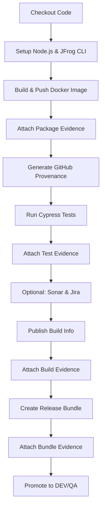

# 🍕 Green Pizza - JFrog Evidence Integration Example

A complete example application demonstrating JFrog Platform Evidence Management integration with a simple pizza ordering web application.

## 📋 Table of Contents

- [Overview](#overview)
- [Features](#features)
- [Quick Start](#quick-start)
- [Evidence Types](#evidence-types)
- [Configuration](#configuration)
- [Running Locally](#running-locally)
- [GitHub Actions Workflow](#github-actions-workflow)
- [Using This as Your Repository](#using-this-as-your-repository)

## 🎯 Overview

**Green Pizza** is a fully functional pizza ordering application that demonstrates how to:

- Build and publish Docker images to JFrog Artifactory
- Attach multiple types of signed evidence to packages
- Create and promote Release Bundles through environments
- Implement automated quality gates with evidence-based policies

This repository serves as a **template** that you can use as your own project.

## ✨ Features

### Application Features
- 🍕 Interactive pizza ordering interface
- 📋 REST API for menu and orders
- 🏥 Health check endpoint
- 🐳 Dockerized application
- 🧪 Cypress E2E tests

### Evidence Integration
- ✅ **Package Signature** - Cryptographically signed package evidence
- 🔐 **GitHub Provenance (SLSA)** - Build provenance and integrity
- 🧪 **Cypress E2E Tests** - End-to-end test results
- 📊 **SonarQube** (optional) - Code quality analysis
- 🎫 **Jira Tickets** (optional) - Issue tracking integration
- 📦 **Build Signature** - Signed build information
- 🚀 **Release Bundle Evidence** - Integration test results

## 🚀 Quick Start

### Prerequisites

- Node.js 18+
- Docker
- JFrog Artifactory instance
- GitHub account (for CI/CD)

### Running Locally

```bash
# 1. Clone or use this repository
git clone <your-repo-url> green-pizza
cd green-pizza

# 2. Install dependencies
npm install

# 3. Start the application
npm start

# 4. Open browser
open http://localhost:3000
```

### Running with Docker

```bash
# Build the image
docker build -t green-pizza:latest .

# Run the container
docker run -p 3000:3000 green-pizza:latest

# Test health endpoint
curl http://localhost:3000/api/health
```

## 📊 Evidence Types

This project demonstrates the following evidence types:

### 1. Package Signature Evidence
**Predicate Type:** `https://jfrog.com/evidence/signature/v1`

Attached directly to the Docker image package with:
- Actor (who built it)
- Timestamp
- Git commit SHA
- Repository information

### 2. GitHub Provenance (SLSA)
**Predicate Type:** `https://slsa.dev/provenance/v1`

Provides build provenance including:
- Build type and builder ID
- Source repository URI and commit
- Build invocation details
- Materials (dependencies)

### 3. Cypress E2E Tests
**Predicate Type:** `https://cypress.io/test-results/v1`

E2E test results with:
- Total tests run
- Pass/fail counts
- Test duration
- Timestamps

### 4. SonarQube Analysis (Optional)
**Integration:** `sonar`

Code quality metrics including:
- Quality gate status
- Code coverage
- Security vulnerabilities
- Code smells

### 5. Jira Ticket Tracking (Optional)
**Predicate Type:** `https://atlassian.com/jira/issues/v1`

Links commits to Jira tickets with:
- Ticket status and transitions
- Assignee and reporter
- Priority and type
- Workflow history

### 6. Build Signature
**Predicate Type:** `https://jfrog.com/evidence/build-signature/v1`

Signed build information with:
- Build actor and workflow
- Run ID and timestamp
- Git commit information

### 7. Release Bundle Evidence
**Predicate Type:** `https://jfrog.com/evidence/testing-results/v1`

Integration test results for the release bundle.

## ⚙️ Configuration

### GitHub Repository Secrets

Navigate to **Settings → Secrets and variables → Actions** and add:

| Secret Name | Description | Required |
|-------------|-------------|----------|
| `ARTIFACTORY_ACCESS_TOKEN` | JFrog access token with deploy permissions | ✅ Yes |
| `PRIVATE_KEY` | Private key for signing evidence | ✅ Yes |
| `JF_USER` | JFrog username | ✅ Yes |
| `JIRA_USERNAME` | Jira email address | ⚪ Optional |
| `JIRA_API_TOKEN` | Jira API token | ⚪ Optional |
| `SONAR_TOKEN` | SonarQube/SonarCloud token | ⚪ Optional |

### GitHub Repository Variables

Navigate to **Settings → Secrets and variables → Actions → Variables** and add:

| Variable Name | Description | Example | Required |
|---------------|-------------|---------|----------|
| `ARTIFACTORY_URL` | JFrog Platform URL | `mycompany.jfrog.io` | ✅ Yes |
| `JIRA_URL` | Jira instance URL | `https://mycompany.atlassian.net` | ⚪ Optional |
| `JIRA_PROJECT_KEY` | Jira project key | `GP` | ⚪ Optional |
| `JIRA_ID_REGEX` | Regex to extract Jira IDs | `(GP-\d+)` | ⚪ Optional |
| `SONAR_URL` | SonarQube URL | `https://sonarcloud.io` | ⚪ Optional |

### Artifactory Setup

1. **Create Repositories:**
   - Docker repository: `green-pizza-docker-dev`
   - Release Bundle repository: `release-bundles-v2`

2. **Create Signing Key:**
   - Go to **Admin → Security → Keys Management**
   - Create a new RSA key named `RSA-SIGNING`

3. **Create Environments:**
   - Create environments: `DEV`, `QA`, `PROD`

4. **Generate Access Token:**
   - Go to **User Profile → Generate Access Token**
   - Scope: `Applied Permissions/User` with read/write permissions

## 🔄 GitHub Actions Workflow

The workflow (`.github/workflows/build-with-evidence.yml`) performs these steps:



### Enabling Optional Evidence

To enable optional evidence types, edit `.github/workflows/build-with-evidence.yml`:

```yaml
# For Jira evidence, change:
if: false  # Change to: if: true

# For SonarQube evidence, change:
if: false  # Change to: if: true
```

## 📦 Using This as Your Repository

### Option 1: Use as Template

1. Click **"Use this template"** on GitHub
2. Create your new repository
3. Clone and start developing

### Option 2: Clone and Customize

```bash
# 1. Copy this directory to your desired location
cp -r green-pizza /path/to/your/new-repo
cd /path/to/your/new-repo

# 2. Remove git history (if you want fresh start)
rm -rf .git
git init
git add .
git commit -m "Initial commit: Green Pizza application"

# 3. Add your remote
git remote add origin <your-repo-url>
git push -u origin main

# 4. Configure GitHub secrets and variables (see Configuration section)

# 5. Run the workflow
# Go to GitHub Actions → Build Green Pizza with Evidence → Run workflow
```

### Customizing for Your Project

1. **Update Application:**
   - Modify `src/server.js` for your backend logic
   - Update `public/index.html` for your frontend
   - Add your own tests in `tests/` and `cypress/e2e/`

2. **Update Workflow:**
   - Change `IMAGE_NAME`, `DOCKER_REPO`, `BUILD_NAME` in `.github/workflows/build-with-evidence.yml`
   - Adjust evidence types based on your needs

3. **Update Documentation:**
   - Modify this README.md
   - Update package.json with your project details

## 🧪 Running Tests

```bash
# Run Jest unit tests
npm test

# Run Cypress E2E tests (headless)
npm run cypress:run

# Open Cypress Test Runner
npm run cypress
```

## 📖 API Documentation

### Endpoints

- `GET /` - Web interface
- `GET /api/health` - Health check
- `GET /api/menu` - Get pizza menu
- `GET /api/pizza/:id` - Get specific pizza
- `POST /api/order` - Place an order

### Example: Place an Order

```bash
curl -X POST http://localhost:3000/api/order \
  -H "Content-Type: application/json" \
  -d '{
    "pizzaId": 2,
    "quantity": 1,
    "customerName": "John Doe"
  }'
```

## 📚 Additional Resources

- [JFrog Evidence Management Documentation](https://jfrog.com/help/r/jfrog-artifactory-documentation/evidence-management)
- [JFrog CLI Documentation](https://jfrog.com/getcli/)
- [SLSA Provenance Specification](https://slsa.dev/spec/v1.0/provenance)
- [Cypress Testing Framework](https://docs.cypress.io/)

## 🤝 Contributing

This is a template repository. Feel free to:
- Fork and customize for your needs
- Submit issues for improvements
- Share your implementations

## 📄 License

MIT License - feel free to use this as a starting point for your own projects!

## 🎯 What's Next?

1. ✅ Configure your JFrog Artifactory
2. ✅ Set up GitHub secrets and variables
3. ✅ Run your first build with evidence
4. ✅ View evidence in Artifactory UI
5. ✅ Create promotion policies
6. ✅ Promote to production!

---

**Built with ❤️ as an example of JFrog Evidence Management**
